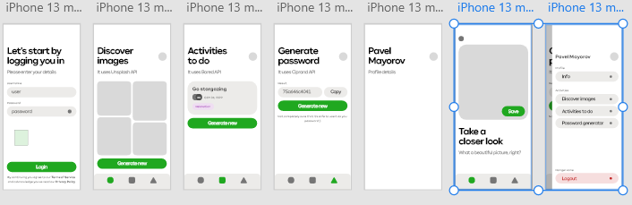

# Okidoki Entertainments
Test assignment for Okidoki made using [React-Native](https://reactnative.dev/), [Expo](https://expo.dev/), Typescript, [Vite](https://vitejs.dev/) and of course [React](https://reactjs.org/) itself.

__NB!__ Work in progress, check [issues](https://github.com/e3stpavel/okidoki-entertainments/issues) and [pull requests](https://github.com/e3stpavel/okidoki-entertainments/pulls) tabs for more details on what I was doing here.

## Steps to reproduce
1. `npm install` - using `npm` here
1. `npm run start` - to run Expo server (for Android and iOS)
    1. `npm run start -- -c` - if want to run without cache
1. `npm run web` - to run web project using Vite

## Naming conventions
* `~/` - root `src` director
* `theme` - get `theme.config.ts` where all the styles should be placed (e.g. colors, fonts, text sizes and so on)
* `@composables` - using `src/composables` for Android and iOS AND `web/src/composables` for web
* `@components` - using `src/components` for Android and iOS AND `web/src/components` for web
* `@features` - using `src/features` for Android and iOS AND `web/src/feature` for web (__NOT IMPELEMTED__ usage for Redux store in the future)
* `@assets` - using `assets` directory (__for web only recommended__ to use `/` for assests because they will be served publicly)

## Project stage
__Work In Progress__ 
1. [Set up project milestone](https://github.com/e3stpavel/okidoki-entertainments/milestone/1) didn't finished yet
1. Implement UI milestone is not started yet
1. ...

### How it supposed to look like

## License
MIT

## Credits
Pavel Mayorov 2022
